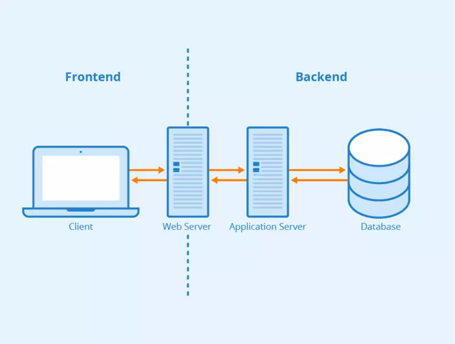
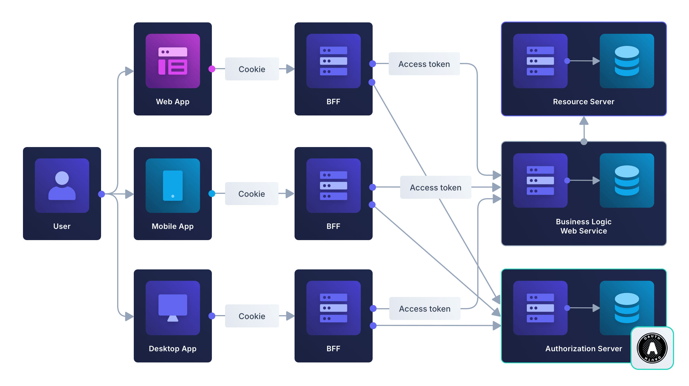
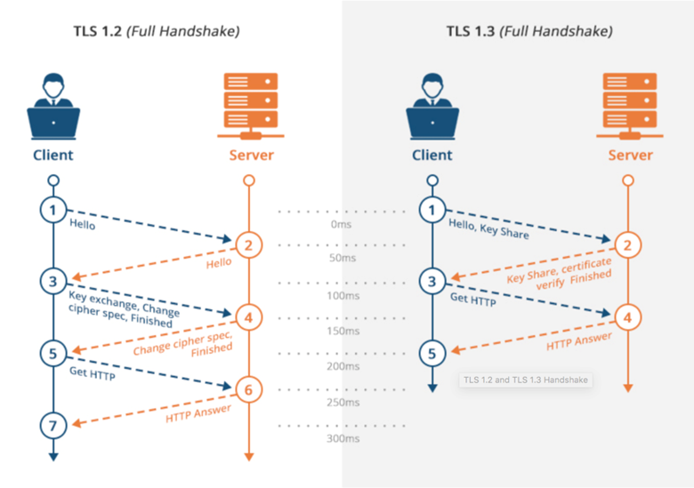

# Deck — Clase 1 · Módulo 1

> Curso de Web Hacking
> Duración: 2 horas (sin receso obligatorio)
> Formato: teoría + práctica intercaladas (demos guiadas)

---

# Web Hacking
## Módulo 1 — Clase 1
### Fundamentos web y reconocimiento

---

## Sobre mí


|||

### Manuel Roldan

AppSec | IA-Sec | Red Team

Informático, CEH|CHFI|AWS-SA|CCNET

+20 años de experiencia — Sector Banca y Finanzas

✉️ manuel.roldan80@gmail.com

🔗 https://www.linkedin.com/in/manuel-alejandro-roldan-ktirex/

---

## Bienvenidos 🎯

- Todo lo que hagamos es **ethical hacking**: solo contra targets autorizados
- Nuestro lab: `juice.labs.manuel-roldan.cloud`
- Participación activa: preguntas, hipótesis, propuestas
- Formato de clase: **Teorico-práctico**
- Si algo no queda claro, frenen y pregunten

---

## Agenda

| Bloque | Contenido | Tiempo aprox. |
|---|---|---|
| **1** | Fundamentos de seguridad web | ~50 min |
| 🧪 | Demo 1: Fingerprinting con WhatWeb y Wappalyzer | ~15 min |
| ☕ | Pausa opcional | ~5 min |
| **2** | Reconocimiento y enumeración | ~40 min |
| 🧪 | Demo 2: Gobuster contra Juice Shop | ~15 min |
| 🏁 | Recap + cierre | ~5 min |

---

## ¿Qué analizamos en seguridad web?

- **Datos** → ¿quién accede? ¿cómo se almacenan? ¿viajan protegidos?
- **Funciones** → ¿se puede abusar la lógica de negocio?
- **Infraestructura** → ¿qué expone el servidor? ¿está actualizado?
- **Clientes** → ¿el navegador confía en input malicioso?

Todo sitio web es una superficie de ataque. Nuestro trabajo es mapearla.

---

## Arquitectura web básica



Cliente (navegador) → HTTP/HTTPS → Servidor (backend) → Base de datos

---

## Arquitectura web moderna



Múltiples clientes (mobile, web, desktop) → API Gateway / BFF → Servicios backend → Datastores


---

## El proceso de análisis web

```
    🔍                 📡                 🗂️              🎯
Comprensión   →   Reconocimiento   →   Enumeración   →   Detección
```

| Fase | ¿Qué hacés? | Ejemplo |
|---|---|---|
| 🔍 Comprensión | Entender stack, lógica, flujos | "Es un SPA con API REST en Node" |
| 📡 Reconocimiento | Info pública y semi-pública | WhatWeb, Wappalyzer, headers |
| 🗂️ Enumeración | Fuerza bruta controlada | Gobuster, Nmap, fuzzing |
| 🎯 Detección | Identificar vulns concretas | Nikto, pruebas manuales |

> 👉 **Hoy cubrimos las fases 1–3.** La detección arranca en la clase 2.

---

## Triada CIA

| Pilar | Significado | Ejemplo de falla |
|---|---|---|
| **Confidencialidad** | Solo lo ven quienes deben | `/api/users` devuelve correos sin auth → fuga |
| **Integridad** | Datos no se alteran sin permiso | `price=10` → `price=1` aceptado → fraude |
| **Disponibilidad** | El servicio responde cuando se necesita | Endpoint sin rate-limit → DoS |

Cada vulnerabilidad que encontremos impacta al menos uno de estos pilares.

---

## Autenticación vs Autorización

| Concepto | Pregunta que responde | Falla típica |
|---|---|---|
| **Autenticación** | ¿Quién sos? | Credenciales débiles, fuerza bruta |
| **Autorización** | ¿Qué podés hacer? | IDOR, privilege escalation |

---

## IDOR — Ejemplo clásico

```
GET /api/orders/1001   ← tu pedido
GET /api/orders/1002   ← pedido de otro usuario
```

Si el servidor no valida que el usuario autenticado sea dueño del recurso → **Insecure Direct Object Reference**.

El usuario está autenticado, pero **no autorizado** para ese objeto.

---

## Sesiones y cookies

El protocolo HTTP es **stateless**. Para mantener sesión usamos cookies:

```
Set-Cookie: session=abc123; HttpOnly; Secure; SameSite=Strict
```

| Flag | Protege contra |
|---|---|
| `HttpOnly` | Robo de cookie vía XSS (JavaScript no puede leerla) |
| `Secure` | Envío por HTTP plano (solo viaja por HTTPS) |
| `SameSite=Strict` | CSRF (no se envía en requests cross-origin) |

---

## ¿Qué pasa si faltan esos flags?

- Sin `HttpOnly` → un XSS roba la sesión con `document.cookie`
- Sin `Secure` → un MITM en red WiFi captura la cookie
- Sin `SameSite` → un sitio malicioso hace requests en tu nombre (CSRF)

Siempre revisamos los headers de cookies como parte del reconocimiento.

---

## Anatomía HTTP — Request

```http
GET /api/products HTTP/1.1
Host: juice.labs.manuel-roldan.cloud
Cookie: session=abc123
Accept: application/json
```

Componentes clave:
- **Método**: GET, POST, PUT, DELETE, PATCH, OPTIONS
- **Path**: el recurso solicitado
- **Headers**: metadatos (auth, content-type, cookies)
- **Body** (en POST/PUT): datos enviados

---

## Anatomía HTTP — Response

```http
HTTP/1.1 200 OK
Content-Type: application/json
X-Frame-Options: DENY
Set-Cookie: session=xyz; HttpOnly

{"products": [...]}
```

Lo que nos interesa: status code, headers de seguridad, body.

---

## Códigos de estado que nos importan

| Código | Significado | Para nosotros |
|---|---|---|
| **200** | OK | El recurso existe y respondió |
| **301/302** | Redirect | ¿A dónde redirige? ¿Hay open redirect? |
| **401** | No autenticado | Existe pero necesita credenciales |
| **403** | Prohibido | Existe, tenemos auth pero no permiso |
| **404** | No encontrado | No existe (o lo ocultan) |
| **500** | Error interno | Posible input no sanitizado, crash |

---

## HTTPS y TLS

**¿Qué protege?**
- Confidencialidad del tránsito (cifrado entre cliente y servidor)
- Integridad (no se puede alterar en el camino)
- Autenticidad del servidor (certificado válido)

**¿Qué NO protege?**
- Vulnerabilidades en la aplicación
- Ataques del lado del servidor
- Un atacante con acceso al servidor
- Phishing con certificado válido (sí, Let's Encrypt da certs a cualquiera)

---

## Handshake TLS — Simplificado




Después del handshake → todo el tráfico va cifrado con clave simétrica.

> Señal de riesgo: certificado inválido → posible MITM o mala configuración.

---

## Security Headers

Headers HTTP que el servidor envía para instruir al navegador:

| Header | Qué hace |
|---|---|
| `Content-Security-Policy` | Controla de dónde se cargan scripts, estilos, imágenes |
| `Strict-Transport-Security` | Fuerza HTTPS (evita downgrade) |
| `X-Frame-Options` | Previene clickjacking (DENY / SAMEORIGIN) |
| `X-Content-Type-Options` | Evita MIME sniffing (`nosniff`) |

---

## ¿Por qué nos importan los headers?

- Si falta `CSP` → XSS es más fácil de explotar
- Si falta `HSTS` → posible downgrade a HTTP
- Si falta `X-Frame-Options` → clickjacking viable
- Si falta `X-Content-Type-Options` → el browser interpreta archivos como scripts

En reconocimiento siempre chequeamos qué headers están (y cuáles faltan).

---

> *"Conoce a tu enemigo y conócete a ti mismo; en cien batallas, nunca estarás en peligro."*

— **Sun Tzu**, El Arte de la Guerra

---

## 🧪 Demo 1: Fingerprinting

**Target:** `juice.labs.manuel-roldan.cloud`

**Objetivo:** Identificar tecnologías, frameworks y versiones del servidor.

¿Por qué? Porque cada tecnología tiene vulnerabilidades conocidas, rutas por defecto y misconfigurations típicas.

---

## 🧪 WhatWeb — Escaneo básico

```bash
whatweb https://juice.labs.manuel-roldan.cloud
```

Esto nos da un resumen rápido: servidor web, framework, cookies, headers.

---

## 🧪 WhatWeb — Modo verbose

```bash
whatweb -v https://juice.labs.manuel-roldan.cloud
```

Más detalle: versiones específicas, plugins detectados, información del certificado.

---

## 🧪 WhatWeb — Agresividad nivel 3

```bash
whatweb -a 3 https://juice.labs.manuel-roldan.cloud
```

Nivel de agresividad:
- **1** (default): un solo request
- **3**: hace requests adicionales para confirmar tecnologías
- **4**: heavy (intrusivo, más requests)

En un pentest real, `-a 3` es razonable para la fase de reconocimiento.

---

## 🧪 Wappalyzer — Desde el browser

1. Instalar extensión Wappalyzer (Chrome/Firefox)
2. Navegar a `https://juice.labs.manuel-roldan.cloud`
3. Click en el ícono de Wappalyzer

Comparar resultados con WhatWeb: ¿detecta lo mismo? ¿detecta más?

---

## 🧪 Preguntas para ustedes

- ¿Qué tecnologías ven? (framework, servidor, lenguaje)
- ¿Qué versiones detectaron?
- ¿Qué nos dice esto sobre posibles vectores de ataque?
- Si ven un framework específico... ¿qué rutas por defecto tiene?

---

## 🧪 Análisis de hallazgos

| Hallazgo | Implicancia |
|---|---|
| Framework X versión Y | Buscar CVEs conocidos para esa versión |
| Servidor Express/Node | Rutas típicas: `/api/`, `/admin/`, errores verbosos |
| Angular frontend | SPA → la lógica está en el cliente, el backend es API |
| Cookies sin flags | Potencial XSS → robo de sesión |

Lo que descubrimos acá **guía** la fase de enumeración.

---

## ☕ Pausa opcional

¿Quieren tomarse 5 minutos para ir al baño, estirar las piernas?

---

## Reconocimiento pasivo — Sin tocar el target

No generás logs, no alertás al blue team. Solo usás info pública.

- **Google Dorks**: buscar archivos expuestos, paneles admin, leaks
- **DNS** (`dig`, `nslookup`): subdominios, registros MX, TXT
- **WHOIS**: quién registró el dominio, fechas, nameservers
- **Shodan / Censys**: qué puertos/servicios se ven desde internet
- **theHarvester**: emails, subdominios, IPs asociadas

> 💡 Si no tocaste el servidor, no dejaste rastro.

---

## 🧪 Google Dorks — Ejemplos

| Dork | ¿Qué busca? |
|---|---|
| `site:target.com filetype:pdf` | Documentos PDF públicos |
| `site:target.com inurl:admin` | Paneles de administración |
| `site:target.com ext:sql OR ext:env` | Archivos de config/DB expuestos |
| `"index of" site:target.com` | Directory listing habilitado |
| `intext:"password" site:target.com` | Páginas con credenciales |

> 🎯 Probalo en vivo: `site:educacionit.com`

---

## 🧪 dig + whois — Demo rápida

```bash
# Resolver DNS del target
dig educacionit.com

# Ver todos los registros
dig ANY educacionit.com

# Información de registro del dominio
whois educacionit.com
```

Preguntas clave:
- ¿Dónde está hosteado? (IP → proveedor)
- ¿Hay subdominios interesantes?
- ¿Cuándo vence el dominio?

---

## Reconocimiento: pasivo vs activo

| | Pasivo | Activo |
|---|---|---|
| **Qué es** | Recopilar info sin tocar el target | Interactuar directamente con el target |
| **Riesgo de detección** | Nulo | Medio-alto |
| **Profundidad** | Superficial | Mayor |
| **Ejemplos** | WHOIS, Google dorks, DNS público, GitHub | Port scan, directory bruteforce, crawling |

En un engagement real: siempre empezamos pasivo, luego activo según el scope.

---

## Pasivo vs Activo — Resumen

### 🟢 Pasivo

- **Interacción:** Ninguna con el target
- **Detección:** Imposible
- **Herramientas:** Google, dig, whois, Shodan
- **Legalidad:** Siempre OK

|||

### 🔴 Activo

- **Interacción:** Directa con el target
- **Detección:** Posible (logs, WAF)
- **Herramientas:** whatweb, nmap, gobuster
- **Legalidad:** Requiere autorización

---

## Recap — ¿Qué vimos hoy?

- Arquitectura web: cliente, servidor, proxy, CDN
- Triada CIA, autenticación vs autorización, IDOR
- HTTP: request/response, métodos, códigos de estado, headers
- HTTPS, TLS handshake, security headers
- Fingerprinting con WhatWeb y Wappalyzer
- Reconocimiento pasivo: Google Dorks, dig, whois, theHarvester
- Diferencia entre reconocimiento pasivo y activo

---

## 📌 Próxima clase

- Enumeración de directorios con Gobuster
- Correlación de fuentes
- Nmap + scripts NSE
- Nikto: escaneo automatizado
- OWASP Top 10 y Threat Modeling

---

## ¿Preguntas?

🎤

---

## ¡Gracias!

Nos vemos en la próxima clase 🚀
